# 📡 Telco Customer Churn Prediction

An end-to-end machine learning project for predicting customer churn in the telecommunications industry. The project covers data analysis, feature engineering, model comparison, explainability, API deployment, and an interactive dashboard.

## 🎯 Business Problem

Customer churn is a major challenge for telecom companies. Identifying customers who are likely to leave can help businesses take proactive retention actions.

This project develops a machine learning system that:

* Analyzes customer behavior and service information
* Predicts the probability of customer churn
* Compares multiple machine learning models
* Explains predictions using SHAP
* Provides an API for predictions
* Provides an interactive Streamlit dashboard
* Includes a Power BI dashboard for business insights

### Dataset

**IBM Telco Customer Churn Dataset**

The dataset contains 7,043 customer records and 21 features covering demographics, account information, and subscribed services.

## 🛠️ Tech Stack

### Data Science & Machine Learning

* Python
* Pandas
* NumPy
* Scikit-learn
* XGBoost
* LightGBM

### Explainable AI

* SHAP

### Experiment Tracking

* MLflow

### Backend & API

* FastAPI
* Uvicorn
* Pydantic

### Dashboard & Visualization

* Streamlit
* Plotly
* Power BI

### Deployment & DevOps

* Docker
* Docker Compose
* GitHub Actions
* Render

### Testing & Code Quality

* Pytest
* Ruff
* Pre-commit
* Trivy

## 📂 Project Structure

```text
telco-churn-prediction/
│
├── .github/
│   ├── workflows/
│   ├── smoke/
│   └── dependabot.yml
│
├── app/
│   ├── api.py
│   ├── schemas.py
│   └── streamlit_app.py
│
├── dashboard/
├── data/
├── figures/
├── models/
├── notebooks/
│   └── churn_analysis.ipynb
│
├── reports/
├── scripts/
├── tests/
│
├── pipeline_lib.py
├── Dockerfile
├── docker-compose.yml
├── pyproject.toml
├── uv.lock
└── RESULTS.md
```

## 🔬 Methodology

The project follows an end-to-end machine learning workflow:

1. Data loading and exploration
2. Data cleaning
3. Train/validation/test splitting
4. Feature engineering
5. Model training
6. Model comparison
7. Hyperparameter tuning
8. Decision-threshold optimization
9. Model evaluation
10. SHAP-based explainability
11. Model serialization
12. API deployment
13. Interactive dashboard development

## 🤖 Machine Learning Models

The project evaluates several model families:

* Logistic Regression
* XGBoost
* LightGBM

Model performance is evaluated using metrics including:

* ROC-AUC
* Accuracy
* Precision
* Recall
* F1-score

## 📊 Model Performance

| Model               | Validation ROC-AUC | Test ROC-AUC |
| ------------------- | -----------------: | -----------: |
| Logistic Regression |             0.8367 |       0.8538 |
| XGBoost             |             0.8356 |       0.8555 |
| LightGBM            |             0.8339 |       0.8548 |

At the selected decision threshold of **0.669**, the served model achieved:

| Metric    | Score |
| --------- | ----: |
| Accuracy  | 0.796 |
| Precision | 0.613 |
| Recall    | 0.621 |
| F1-score  | 0.617 |

## 🔍 Explainability

SHAP is used to understand which features contribute most to churn predictions.

Important churn-related features identified by the model include:

* Contract type
* Customer tenure
* Internet service
* Monthly charges
* Total charges

The explainability component helps translate model predictions into interpretable business insights.

## 📊 Power BI Dashboard

The project also includes an interactive Power BI dashboard focused on customer retention.

The dashboard covers:

* Executive Overview
* Risk Segmentation
* Retention Targeting
* Model Insights

Users can explore churn patterns across different customer segments and investigate the factors associated with higher churn risk.

## 🚀 Getting Started

### 1. Clone the Repository

```bash
git clone https://github.com/ShakawatBhai/customer-churn-analysis-project.git
cd customer-churn-analysis-project
```

### 2. Install Dependencies

If using `uv`:

```bash
uv sync
```

### 3. Run the Notebook

```bash
uv run jupyter lab notebooks/churn_analysis.ipynb
```

Alternatively:

```bash
uv run jupyter nbconvert --to notebook --execute --inplace notebooks/churn_analysis.ipynb
```

### 4. Run MLflow

```bash
uv run mlflow ui --backend-store-uri mlruns
```

### 5. Start the FastAPI Backend

```bash
uv run uvicorn app.api:app --reload
```

API documentation:

```text
http://localhost:8000/docs
```

### 6. Start the Streamlit Dashboard

```bash
uv run streamlit run app/streamlit_app.py
```

The Streamlit application will normally be available at:

```text
http://localhost:8501
```

## 🐳 Docker

Build and run the application with Docker Compose:

```bash
docker-compose up --build -d
```

The API can then be accessed through:

```text
http://localhost:8000
```

Swagger documentation:

```text
http://localhost:8000/docs
```

## 📈 Key Business Insights

The analysis indicates that churn risk is associated with several customer characteristics, particularly:

* Month-to-month contracts
* Shorter customer tenure
* Internet service type
* Higher monthly charges
* Higher total charges

These insights can support targeted customer-retention strategies.

## 📌 Project Highlights

* End-to-end machine learning workflow
* Multiple classification models
* Model comparison and evaluation
* Decision-threshold optimization
* SHAP explainability
* MLflow experiment tracking
* FastAPI prediction service
* Streamlit interactive dashboard
* Power BI business dashboard
* Dockerized deployment
* Automated testing and CI/CD

## 📄 License

Please refer to the repository's `LICENSE` file for the applicable license and usage conditions.

## In short

An end-to-end machine learning project that predicts telecom customer churn — and, just as importantly, decides *who to call*. The analysis is one notebook, the model ships as a published container image, and every release is gated on the model still clearing its performance floor.

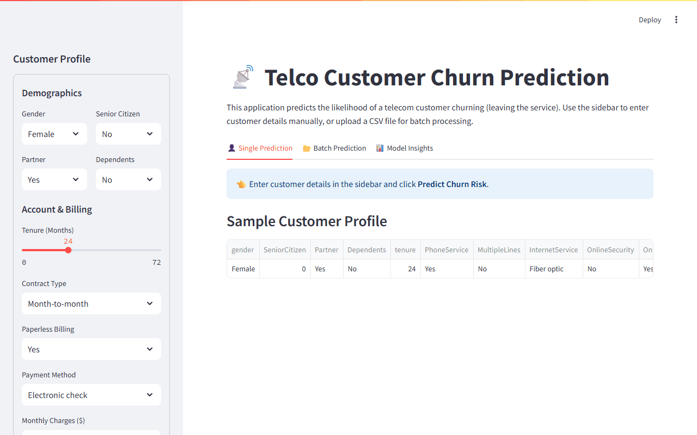

*Live dashboard: enter a customer profile → churn probability gauge + per-prediction SHAP explanation.*

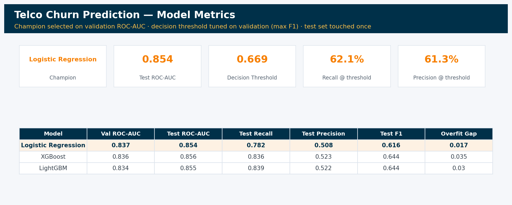
### Methodology Notes

- **Model selection** uses the validation set (15%); the test set (15%) is reserved
  strictly for the final unbiased performance estimate.
- **Feature engineering lives inside the sklearn Pipeline** (`FeatureEngineer` step in `pipeline_lib.py`),
  so statistics such as the MonthlyCharges median used by `high_value_short_tenure`
  are learned from training folds only. The saved `models/final_pipeline.joblib`
  accepts raw customer records — no manual feature engineering is needed at serving time.
- **The decision threshold** is tuned on the validation set (maximizing F1) and stored
  in `models/model_metadata.json`; the API applies it automatically instead of a
  hardcoded 0.5.
- **Mutual information** is used to sanity-check feature signal before modeling
  (`figures/feature_selection_mi.png`); models still train on the full feature set.

## 📊 Power BI Dashboard — Customer Retention Command Center

A four-page interactive Power BI dashboard (plus a full dark-mode twin of every
page) built on the model's scored output:

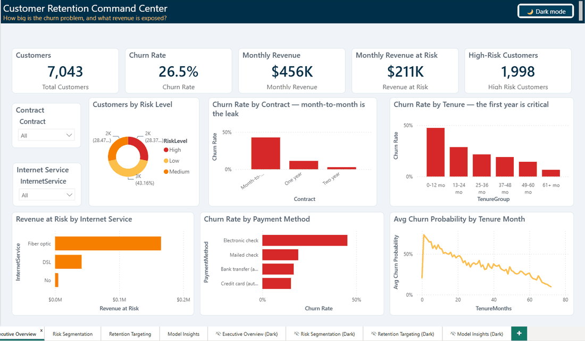

*Live usage: KPI cards and every visual cross-filter from the Contract slicer,
four story pages (Executive Overview → Risk Segmentation → Retention Targeting →
Model Insights), and a **dark-mode toggle button** that switches the entire
report between light and dark themes (palette: `#003049 / #D62828 / #F77F00 /
#FCBF49`).*

- **Executive Overview** — how big is the churn problem, and what revenue is exposed?
- **Risk Segmentation** — where does churn concentrate? Slice any dimension.
- **Retention Targeting** — a ranked retention call list with savable revenue.
- **Model Insights** — champion model card, SHAP drivers, and a reliability plot
  (observed churn rate per predicted-probability bucket).

> **Read before quoting these pages.** All 7,043 customers are scored by a
> pipeline trained on 4,932 of them, so ~70% of every dashboard figure is
> in-sample and optimistic; the model card also shows 0.5-threshold metrics while
> the API serves 0.669. See [`RESULTS.md`](RESULTS.md) §6.

Open `dashboard/ChurnRetention/ChurnRetention.pbip` with Power BI Desktop
(PBIP/PBIR project format — enable *Power BI Project files* in Preview
features). Page navigation buttons require **Ctrl+Click** inside Desktop.

## 🖼️ Output Gallery

| | |
|---|---|
| 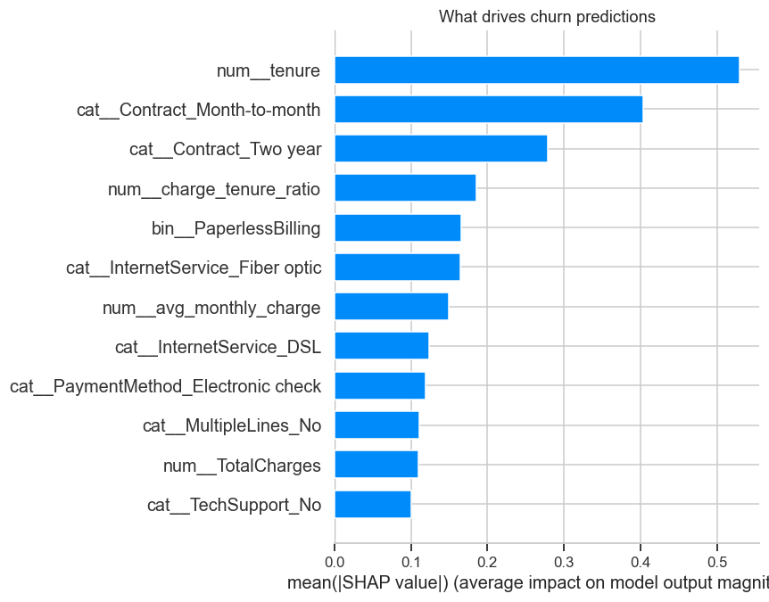 | 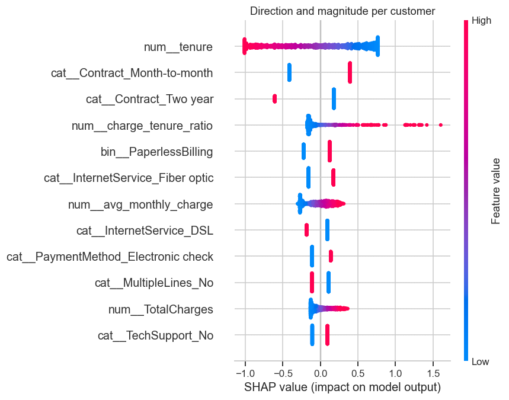 |
| 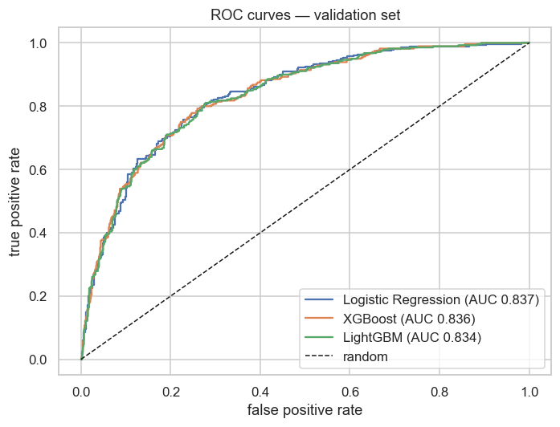 | 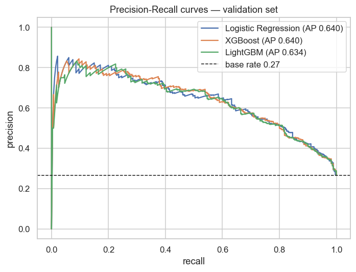 |
| 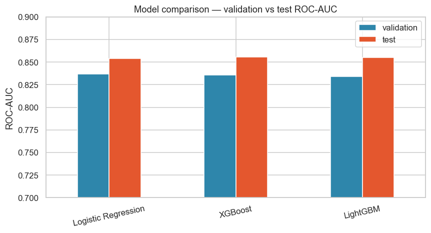 | 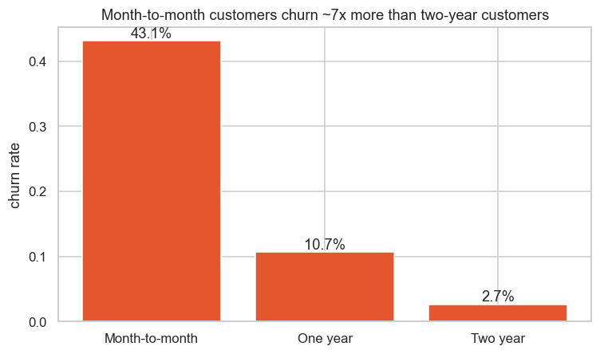 |
| 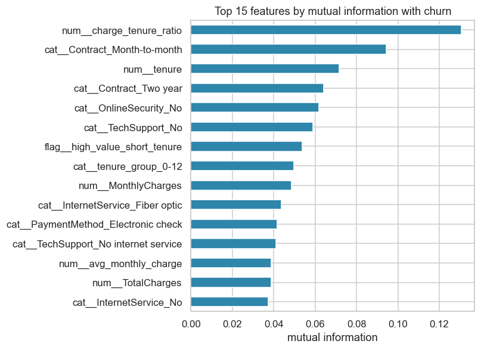 | 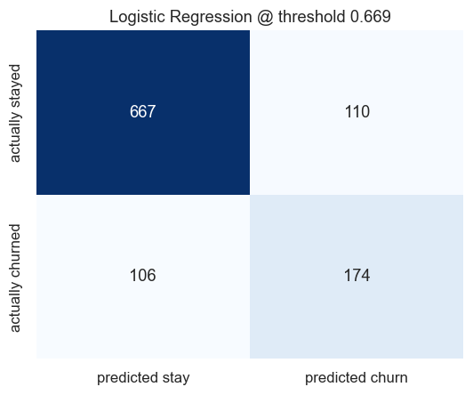 |

